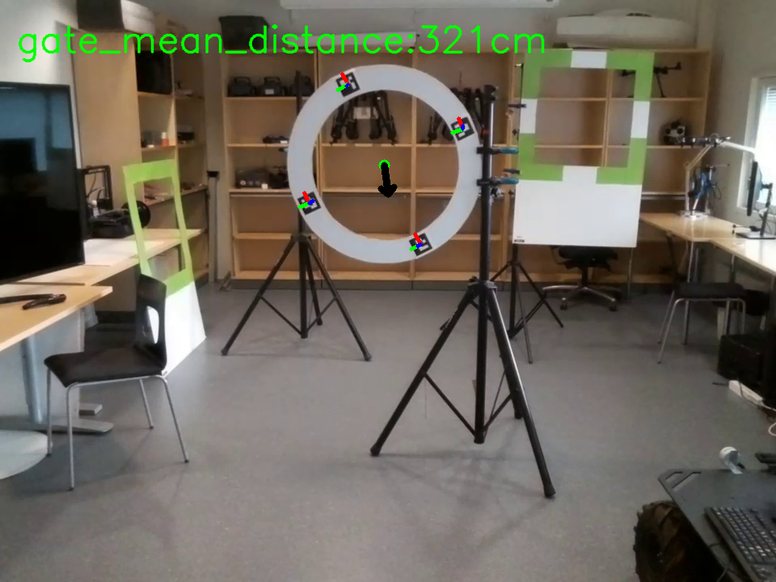
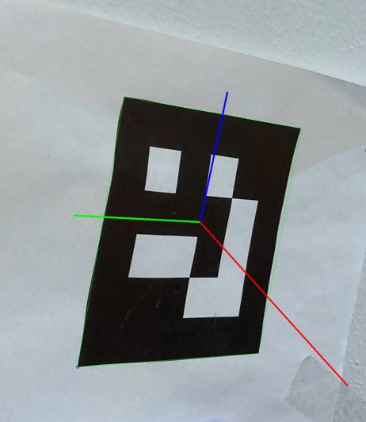
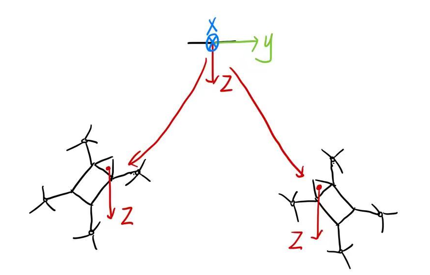
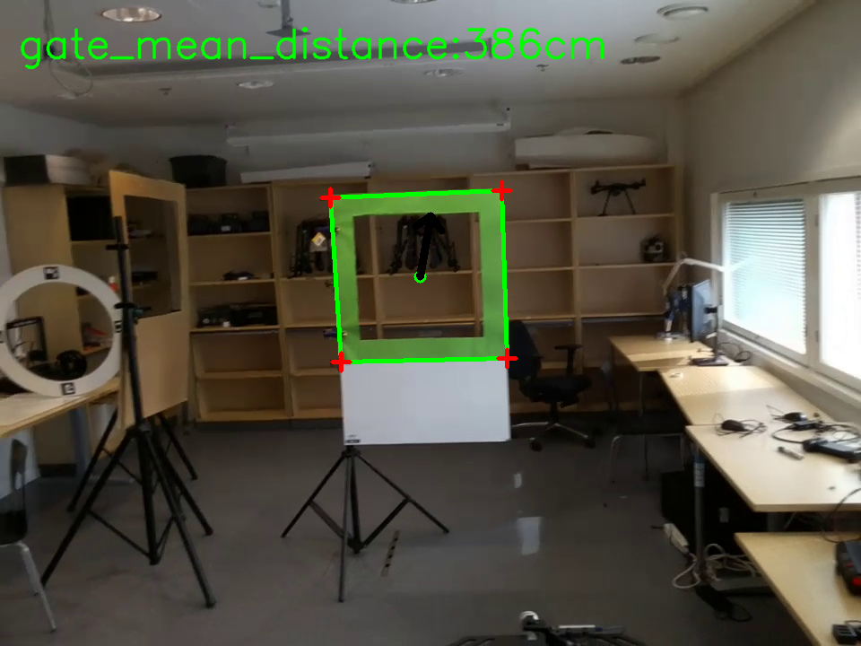
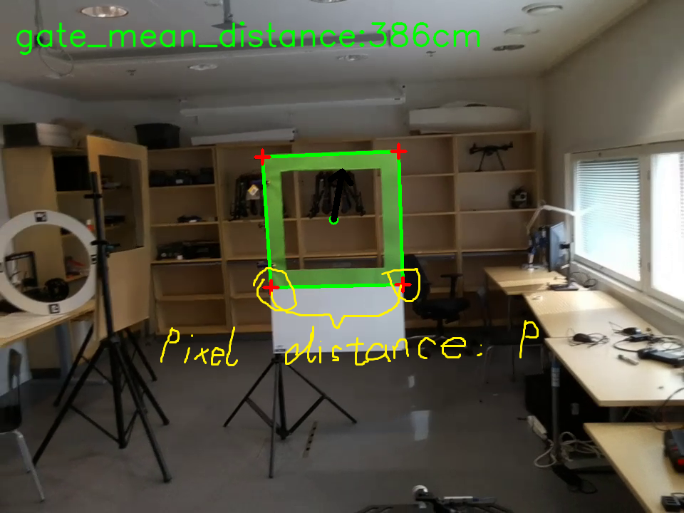
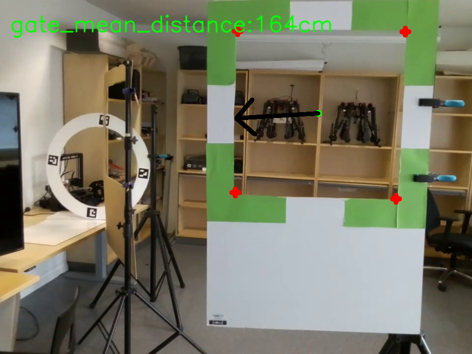

# Tello-project-of-RAS-course


The drone needs to pass through 3 gates. I will explain them one by one. For each gate, the code is divided into 2 parts--Information_Gain and Control.


## Prerequisites

First of all, make sure you have ros2 in your Linux, then we use this [ros2](https://github.com/tentone/tello-ros2) package to control the drone.

## Run our code

Just use:

```
$ python3 XXX.py
```

## First gate (Aruco_gate):

This is the view of the camera when our python code is working.



#### Information_Gain:

First, I used OpenCV to detect out four Aruco_markers, then calculate the center of the Aruco_markers (marker_center_X, marker_center_Y), which we use as the center of the gate. Then, I used estimatePoseSingleMarkers of OpenCV, to detect rvec and tvec. 

For tvec: +Z is in front of the camera. I calculate the mean distance to those Aruco_markers on Z axis, and take this value as gate_mean_distance.

For rvec, I use Rodrigues' rotation formula to get rotation matrix, then we only care about the Z axis of Aruco_markers, which is the red axis in the picture below. 



Then let’s look at this picture. The drone is basically towards the Aruco marker.



Now, if the red axis is on the drone’s right, it implies that the Aruco marker is on the right of the whole drone. In the same way, if the red axis is on the drone’s left, it implies that the Aruco marker is on the left of the whole drone. Anyway, rvec can tell us if the gate is on the drone’s right or left.

In summary, for Information_Gain, we can get these information:
+ Center of the gate (marker_center_X, marker_center_Y).
+ The distance from the drone to the gate: gate_mean_distance.
+ If the gate is on the drone’s right or left: right/left.


#### Control:
+ Step1: Adjust the drone vertically in liner.z, rotate the drone in angular.z. Let it be towards the center of the gate! (Step1 relies on marker_center_X, marker_center_Y)
+ Step2: Detect if the drone is close enough. Approximately, 200cm is the threshold value. (Step2 relies on gate_mean_distance) 
    If it's not close enough, then fly to get close.
    If it's close enough, start the next step.
+ Step3: Check and move if it's too left and right (Step2 relies on right/left)
+ Step4: Again! Adjust the drone vertically in liner.z, rotate the drone in angular.z. Let it be towards to the center of the gate! (Step4 relies on marker_center_X, marker_center_Y)
+ Step5: Pass through the gate


## Second gate:
This is the view of the camera when our python code is working.


#### Information_Gain:

We use cv2.findContours to detect some contours. Then we managed to find the biggest contour, of all contours. Then we use cv2.approxPolyDP to find a polygon from the biggest contour. 

For this polygon, we can calculate its center--(marker_center_X, marker_center_Y), which we take as the center of the gate.

Then we always try to find two vertexes of this polygon, which have the maximal y value in the OpenCV picture. And we calculate the pixel distance of these two points.



We use this formula to calculate the gate_mean_distance: $ F = (P * D) / W $
Here is a detailed explanation of this [method](https://pyimagesearch.com/2015/01/19/find-distance-camera-objectmarker-using-python-opencv/).


In summary, for Information_Gain, we can get these information:
+ Center of the gate (marker_center_X, marker_center_Y)
+ The distance from the drone to the gate: gate_mean_distance.


#### Control:

+ Step1: Adjust the drone vertically in liner.z, rotate the drone in angular.z. Let it be towards to the center of the gate! (Step1 relies on marker_center_X, marker_center_Y)
+ Step2: Detect if the drone is close enough, About 200cm is the threshold value. (Step2 relies on gate_mean_distance) 
    If it's not close enough, then fly to get close.
    If it's close enough, start the next step.
+ Step3: Again! Adjust the drone vertically in liner.z, rotate the drone in angular.z. Let it be towards to the center of the gate! (Step4 relies on marker_center_X, marker_center_Y)
+ Step4: Pass through the gate


## Third gate:
This is the view of the camera when our python code is working.


#### Information_Gain:

First, we try to filter out all green points. 
As you can see in the picture above, there are 4 green corners. In other words, there are 4 green clusters, which implies that we can use the K-means algorithm to find 4 clusters. Then, we can calculate the center of these four clusters --(marker_center_X, marker_center_Y), which we take as the center of the gate.
And just like the second gate, we can use the same way to calculate gate_mean_distance.

In summary, for the Information_Gain part, we can get these information.
+ Center of the gate (marker_center_X, marker_center_Y)
+ The distance from the drone to the gate: gate_mean_distance.


#### Control:

It’s as same as the second one.